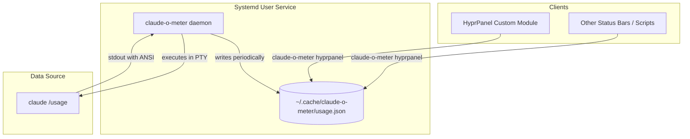

# Architecture

## High-Level Overview

claude-o-meter uses a daemon/client architecture to efficiently provide usage metrics to status bar integrations without repeatedly querying the Claude CLI.



### Components

| Component | Description |
|-----------|-------------|
| **Daemon** | Systemd user service running `claude-o-meter daemon`. Polls `claude /usage` at configurable intervals and writes JSON to a cache file. |
| **Cache File** | JSON file at `~/.cache/claude-o-meter/usage.json` containing the latest `UsageSnapshot`. |
| **Client Mode** | `claude-o-meter hyprpanel` reads the cache file and formats output for status bar consumption. |

### Modes

```
┌─────────────────────────────────────────────────────────────────┐
│  claude-o-meter query     → One-shot query, JSON to stdout      │
│  claude-o-meter daemon    → Background service, writes to file  │
│  claude-o-meter hyprpanel → Client reads file, formats output   │
└─────────────────────────────────────────────────────────────────┘
```

### Data Flow

1. **Daemon** spawns `claude /usage` in a PTY (via `script` command)
2. **Daemon** monitors output for completion patterns (`% used` or `% left`)
3. **Daemon** parses output, strips ANSI codes, extracts metrics
4. **Daemon** writes `UsageSnapshot` JSON to cache file
5. **Client** (e.g., HyprPanel module) invokes `claude-o-meter hyprpanel`
6. **Client mode** reads cache file, transforms to `HyprPanelOutput` format
7. **Status bar** displays the formatted metrics

### Why This Architecture?

- **Efficiency**: The Claude CLI takes 2-3 seconds to return results. Running it on every status bar refresh would cause delays.
- **Decoupling**: Status bars poll frequently (every few seconds). The daemon polls infrequently (every 60s by default).
- **Reliability**: If the daemon fails, clients show stale data rather than hanging.

---

## Account Type Detection

The tool detects the Claude account type by parsing the header line from `claude /usage` output.

### Patterns

The CLI outputs a header line in the format:
```
· claude <type> · user@email.com
```

Three regex patterns match this format (case-insensitive):

| Pattern | Matches | Account Type |
|---------|---------|--------------|
| `(?i)·\s*claude\s+pro` | `· claude pro` | `pro` |
| `(?i)·\s*claude\s+max` | `· claude max` | `max` |
| `(?i)·\s*claude\s+api` | `· claude api` | `api` |

### Detection Logic

Located in `detectAccountType()` (`main.go`):

1. Check patterns in order: pro → max → api
2. Return the first matching account type
3. If no pattern matches, return `unknown`

The function does **not** use fallback heuristics. If the header format is unrecognized (e.g., AWS Bedrock, Google Vertex, or future integrations), it returns `unknown` rather than guessing.

### Account Types

```go
const (
    AccountTypePro     = "pro"     // Claude Pro subscription
    AccountTypeMax     = "max"     // Claude Max subscription
    AccountTypeAPI     = "api"     // API access
    AccountTypeUnknown = "unknown" // Unrecognized format
)
```
