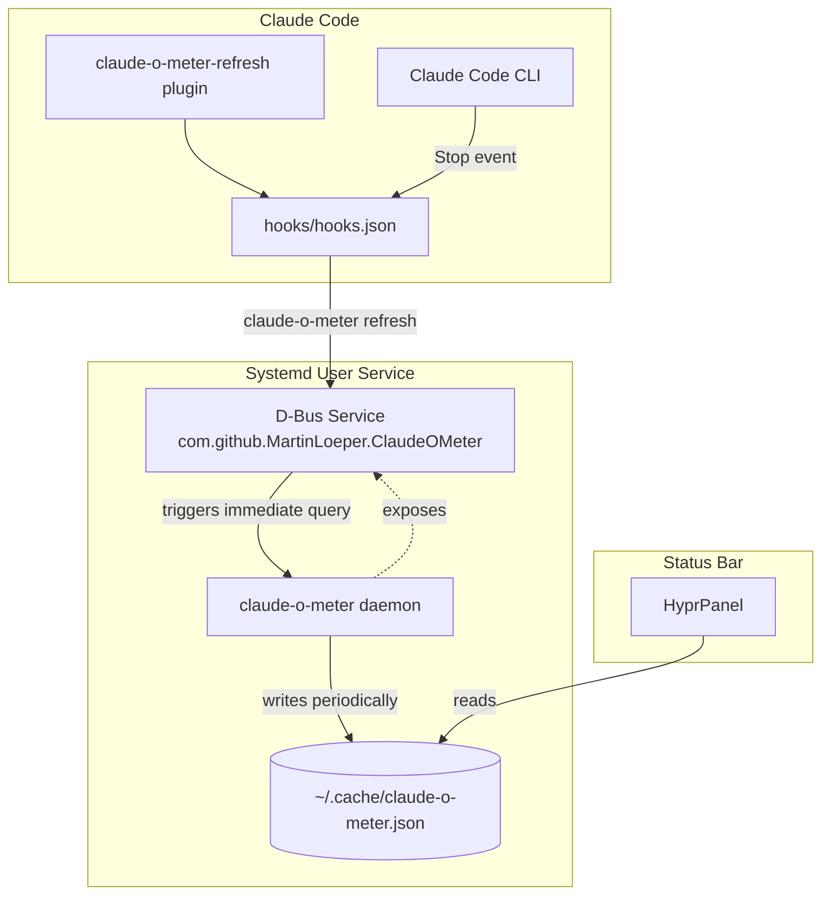
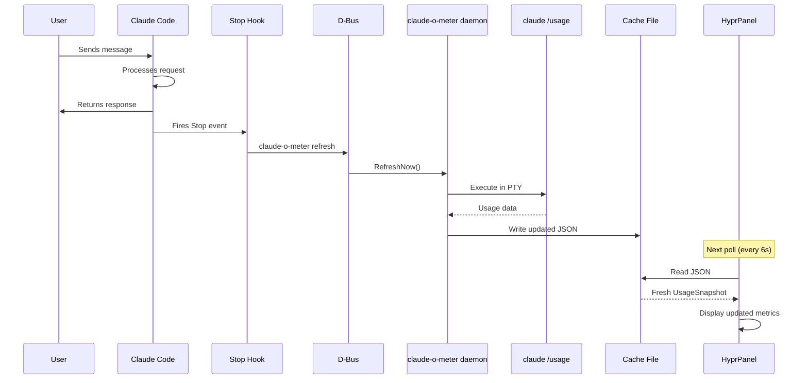
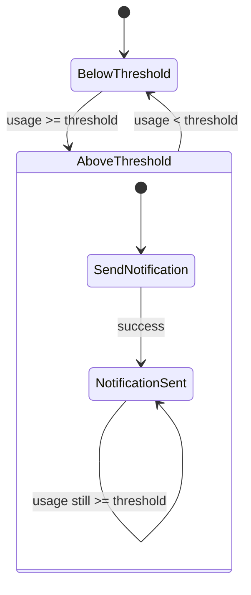

# Architecture

## High-Level Overview

claude-o-meter uses a daemon/client architecture to efficiently provide usage metrics to status bar integrations without repeatedly querying the Claude CLI.


### Components

| Component | Description |
|-----------|-------------|
| **Daemon** | Systemd user service running `claude-o-meter daemon`. Polls `claude /usage` at configurable intervals and writes JSON to a cache file. |
| **Cache File** | JSON file at `~/.cache/claude-o-meter/usage.json` containing the latest `UsageSnapshot`. |
| **Client Mode** | `claude-o-meter hyprpanel` reads the cache file and formats output for status bar consumption. |

### Modes

```
┌─────────────────────────────────────────────────────────────────┐
│  claude-o-meter query     → One-shot query, JSON to stdout      │
│  claude-o-meter daemon    → Background service, writes to file  │
│  claude-o-meter hyprpanel → Client reads file, formats output   │
└─────────────────────────────────────────────────────────────────┘
```

### Data Flow

1. **Daemon** spawns `claude /usage` in a PTY (via `script` command)
2. **Daemon** monitors output for completion patterns (`% used` or `% left`)
3. **Daemon** parses output, strips ANSI codes, extracts metrics
4. **Daemon** writes `UsageSnapshot` JSON to cache file
5. **Client** (e.g., HyprPanel module) invokes `claude-o-meter hyprpanel`
6. **Client mode** reads cache file, transforms to `HyprPanelOutput` format
7. **Status bar** displays the formatted metrics

### HyprPanel Integration Sequence


### Why This Architecture?

- **Efficiency**: The Claude CLI takes 2-3 seconds to return results. Running it on every status bar refresh would cause delays.
- **Decoupling**: Status bars poll frequently (every few seconds). The daemon polls infrequently (every 60s by default).
- **Reliability**: If the daemon fails, clients show stale data rather than hanging.

### Auto-Refresh on Quota Reset

The daemon also schedules an automatic refresh 60 seconds after the earliest quota reset time. This ensures the status bar displays 0% usage promptly after quotas renew, without waiting for the next poll interval.

---

## D-Bus Integration

The daemon can expose a D-Bus service on the session bus, enabling external tools to trigger immediate usage refreshes without waiting for the next poll interval.


### D-Bus Refresh Sequence

When an external tool triggers a refresh via D-Bus, the daemon immediately queries Claude usage instead of waiting for the next poll cycle:


### D-Bus Service Details

| Property | Value |
|----------|-------|
| Service Name | `com.github.MartinLoeper.ClaudeOMeter` |
| Object Path | `/com/github/MartinLoeper/ClaudeOMeter` |
| Interface | `com.github.MartinLoeper.ClaudeOMeter` |
| Method | `RefreshNow()` |

### Use Case: Claude Code Hooks

The primary use case for D-Bus integration is triggering a refresh after Claude Code completes a request. This provides immediate feedback in the status bar about updated usage:

```
┌─────────────────┐     ┌─────────────────┐     ┌─────────────────┐
│  Claude Code    │────▶│  PostToolUse    │────▶│   dbus-send     │
│  completes      │     │  Hook fires     │     │   RefreshNow    │
└─────────────────┘     └─────────────────┘     └────────┬────────┘
                                                         │
                                                         ▼
┌─────────────────┐     ┌─────────────────┐     ┌─────────────────┐
│  HyprPanel      │◀────│  Cache file     │◀────│  Daemon queries │
│  shows update   │     │  updated        │     │  immediately    │
└─────────────────┘     └─────────────────┘     └─────────────────┘
```

---

## Claude Code Hooks Integration (`enableClaudeCodeHooks`)

When `enableClaudeCodeHooks = true` in the Home Manager module, a Claude Code plugin is installed that automatically triggers a usage refresh when Claude conversations end. This provides real-time status bar updates without relying on frequent polling.

### Architecture Overview



### How It Works

1. **Plugin Installation**: The Home Manager module creates a Claude Code marketplace at `~/.claude/claude-o-meter-plugins/` containing the `claude-o-meter-refresh` plugin
2. **Settings Registration**: The plugin is registered in Claude Code's `settings.json` via `extraKnownMarketplaces` and `enabledPlugins`
3. **Stop Hook**: When a Claude conversation ends, the plugin's Stop hook executes `claude-o-meter refresh`
4. **D-Bus Refresh**: The refresh command sends a D-Bus signal to the daemon, triggering an immediate usage query
5. **Status Update**: The daemon writes fresh metrics to the cache file, which the status bar picks up on its next poll

### Stop Hook Sequence



### Plugin Structure

```
~/.claude/claude-o-meter-plugins/
├── .claude-plugin/
│   └── marketplace.json          # Marketplace metadata
└── claude-o-meter-refresh/
    ├── package.json              # Plugin metadata
    └── hooks/
        └── hooks.json            # Stop hook configuration
```

### hooks.json Configuration

```json
{
  "hooks": {
    "Stop": [
      {
        "matcher": "",
        "hooks": [
          {
            "type": "command",
            "command": "/nix/store/.../bin/claude-o-meter refresh",
            "timeout": 7
          }
        ]
      }
    ]
  }
}
```

The command uses the full Nix store path to ensure it works regardless of the user's PATH.

### Why Stop Hook Instead of PostToolUse?

| Hook | When it fires | Use case |
|------|---------------|----------|
| `PostToolUse` | After each tool call | Too frequent, would spam refreshes |
| `Stop` | When conversation ends | Perfect timing for usage update |

The Stop hook fires once per conversation, providing an accurate usage snapshot after Claude has finished processing.

### Interval Adjustment

When hooks are enabled, the default polling interval changes from 60 seconds to 5 minutes:

| Mode | Interval | Reason |
|------|----------|--------|
| Polling only | 60s | Frequent updates needed |
| With hooks | 5m | Hooks provide real-time updates; polling is just a fallback |

Users can override this with the `interval` option if needed.

---

## Edge Cases

### Cache File Missing (First Startup)

When `claude-o-meter hyprpanel` is invoked before the daemon has written its first cache file, the client **blocks** until the file exists. This ensures the status bar receives valid data rather than a transient "loading" state.


**Behavior Summary:**

| Scenario | Client Behavior |
|----------|-----------------|
| Cache file exists | Read immediately, return formatted output |
| Cache file missing | Block, poll every 500ms until file appears |

**Rationale:** Blocking prevents the status bar from displaying a flickering "loading" indicator on every poll cycle during startup. The daemon typically writes its first result within 2-3 seconds, so the delay is minimal.

---

## Account Type Detection

The tool detects the Claude account type by parsing the header line from `claude /usage` output.

### Patterns

The CLI outputs a header line in the format:

```text
· claude <type> · user@email.com
```

Three regex patterns match this format (case-insensitive):

| Pattern | Matches | Account Type |
|---------|---------|--------------|
| `(?i)·\s*claude\s+pro` | `· claude pro` | `pro` |
| `(?i)·\s*claude\s+max` | `· claude max` | `max` |
| `(?i)·\s*claude\s+api` | `· claude api` | `api` |

### Detection Logic

Located in `detectAccountType()` (`main.go`):

1. Check patterns in order: pro → max → api
2. Return the first matching account type
3. If no pattern matches, return `unknown`

The function does **not** use fallback heuristics. If the header format is unrecognized (e.g., AWS Bedrock, Google Vertex, or future integrations), it returns `unknown` rather than guessing.

### Account Types

```go
const (
    AccountTypePro     = "pro"     // Claude Pro subscription
    AccountTypeMax     = "max"     // Claude Max subscription
    AccountTypeAPI     = "api"     // API access
    AccountTypeUnknown = "unknown" // Unrecognized format
)
```

---

## Desktop Notifications

The daemon can send desktop notifications via D-Bus when usage exceeds a configurable threshold.

### Configuration

| Flag | Description |
|------|-------------|
| `--notify-threshold` | Percentage threshold (0-100). Notification triggers when session usage >= threshold |
| `--notify-timeout` | Display timeout (e.g., "5s"). 0 = never auto-close, unset = server default |
| `--notify-icon` | Path to notification icon (PNG/SVG) |

### Home Manager Options

```nix
services.claude-o-meter = {
  enable = true;
  notifyThreshold = 80;   # Notify at 80% usage
  notifyTimeout = "5s";   # Auto-close after 5 seconds
};
```

### Behavior

1. **Threshold Check**: After each daemon refresh, session usage is compared against the threshold
2. **One-Shot Notification**: Notification is sent once when threshold is exceeded
3. **Reset on Drop**: Notification state resets when usage drops below threshold, allowing a new notification on the next crossing



### Technical Details

Notifications are sent via the `org.freedesktop.Notifications.Notify` D-Bus method. The daemon connects to the session bus and calls the notification service provided by the desktop environment (e.g., mako, dunst, GNOME Shell).

| Parameter | Value |
|-----------|-------|
| `app_name` | `claude-o-meter` |
| `app_icon` | Path to Claude icon PNG |
| `summary` | `Claude Usage High` |
| `body` | `Session usage at X% (threshold: Y%)` |
